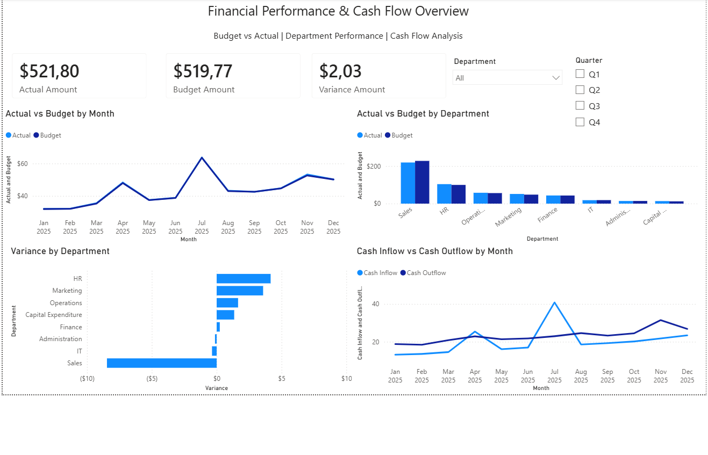
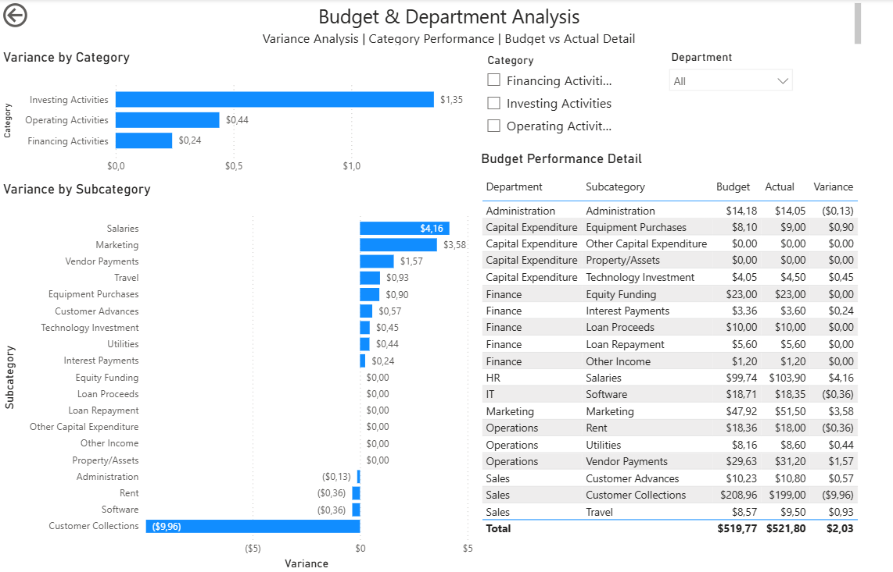

# Cash Flow & Budget Analysis

## Project Overview

This project analyses financial performance, budget variance and cash flow using Power BI.

The goal is to compare actual performance against budget, identify the main sources of variance, analyse departmental performance and monitor monthly cash inflows and outflows.

## Dataset

The dataset contains 228 financial transactions for 2025, including:

- Transaction date and department
- Financial category and subcategory
- Budget and actual amounts
- Cash inflows and cash outflows
- Revenue and operating expenses
- Opening and closing cash balances
- Forecast amounts
- Budget variance

## Data Preparation

Data preparation and quality checks were performed in Power Query.

The main steps included:

- Correcting data types
- Checking for missing values and errors
- Verifying transaction ID uniqueness
- Validating budget variance calculations
- Handling zero-budget records
- Creating a calculated variance percentage
- Creating month fields for chronological reporting

All 25 source columns were validated with no missing values or data type errors.

The dataset contains 228 unique transaction IDs.

68 records have a zero budget. Percentage variance for these records was treated as null to avoid division by zero.

## Power BI Dashboard

The report contains two interactive pages.

### 1. Financial Overview

Provides a high-level view of financial performance, including:

- Actual Amount
- Budget Amount
- Variance Amount
- Actual vs Budget by Month
- Actual vs Budget by Department
- Variance by Department
- Cash Inflow vs Cash Outflow by Month
- Department and Quarter filters



### 2. Budget & Department Analysis

Provides detailed variance analysis, including:

- Variance by Category
- Variance by Subcategory
- Budget vs Actual detail by department
- Category and Department filters



## Key Insights

- Total Actual Amount was **$521.80**, compared with a Budget Amount of **$519.77**, resulting in an overall variance of **+$2.03**.
- Investing Activities recorded the largest positive category variance at **+$1.35**.
- Salaries (**+$4.16**) and Marketing (**+$3.58**) were among the largest positive subcategory variances.
- Customer Collections recorded the largest negative variance at **-$9.96**.
- Large positive and negative variances offset each other, resulting in a relatively small overall variance of **+$2.03**.
- Department-level analysis shows that the overall result can hide significant differences between individual business areas.

## Recommendations

- Investigate the significant negative variance in Customer Collections.
- Review the drivers behind higher-than-budget Salaries and Marketing amounts.
- Monitor budget variance at subcategory level rather than relying only on the overall variance.
- Use monthly Actual vs Budget monitoring to identify deviations earlier.
- Review cash inflows and outflows regularly to identify periods of potential cash pressure.

## Tools

- Power BI
- Power Query
- Excel / CSV

## Repository Structure

```text
cash_flow_budget_analysis/
│
├── README.md
├── data/
│   └── cash_flow_transactions.csv
├── powerbi/
│   └── cash_flow_budget_analysis.pbix
└── images/
    ├── financial_overview.png
    └── budget_analysis.png